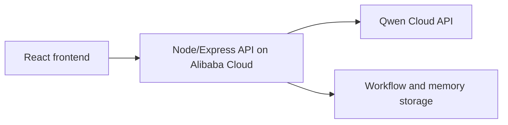

# Alibaba Cloud Deployment Proof Plan

This file is the submission-facing place to document how FunnelOps Autopilot runs on Alibaba Cloud.

## Current Status

Local vertical slice is working. Qwen Cloud calls have been verified locally. The backend is packaged for container-style deployment with `Dockerfile`.

## Target Backend Requirement

The hackathon requires proof that the backend is running on Alibaba Cloud. The proof package should include:

- A short screen recording of the deployed backend running on Alibaba Cloud.
- A public repository link to code that demonstrates Alibaba Cloud service/API usage.
- Environment variable setup without exposing secrets.
- A health endpoint that confirms the backend is alive.

## Planned Deployment Shape



## Recommended Alibaba Cloud Path

Recommended service: Alibaba Cloud Function Compute with a Custom Container HTTP function.

The simplest acceptable proof target is a public backend URL that serves:

```http
GET /api/health
```

For hackathon proof, the first deployment does not need a custom domain. A generated Alibaba Cloud service URL is enough if it is public and testable.

Why this path:

- Function Compute is fully managed and avoids setting up a long-running VM.
- Custom Container functions can run an Express HTTP backend.
- Alibaba Cloud documentation says custom container functions should use an image from Alibaba Cloud Container Registry in the same region and account.
- For ARM-based local machines, build images with `--platform linux/amd64` before pushing to Alibaba Cloud Container Registry.

## Production Start Command

```bash
npm start
```

This runs:

```bash
tsx server/index.ts
```

## Container Build

```bash
docker build --platform linux/amd64 -t funnelops-autopilot .
docker run --rm -p 8787:8787 \
  -e QWEN_API_KEY=your_key_here \
  -e QWEN_BASE_URL=https://dashscope-intl.aliyuncs.com/compatible-mode/v1 \
  -e QWEN_MODEL=qwen3.7-plus \
  funnelops-autopilot
```

Then test:

```bash
curl http://localhost:8787/api/health
```

## Function Compute Settings

Use these values when creating the Function Compute custom container function:

- Handler type: HTTP request handler.
- Container image: image pushed to Alibaba Cloud Container Registry.
- Listening port: `8787`.
- Start command: leave blank if the image uses the Dockerfile CMD, or set `npm start`.
- Public access: enable HTTP access so judges can open the generated endpoint.
- Environment variables:
  - `QWEN_API_KEY`
  - `QWEN_BASE_URL`
  - `QWEN_MODEL`
  - `PORT=8787`

## Alibaba Cloud References

- Function Compute overview: https://www.alibabacloud.com/help/en/functioncompute/fc-2-0/product-overview/what-is-function-compute
- Create a Custom Container function: https://help.aliyun.com/en/functioncompute/fc-2-0/user-guide/create-a-custom-container-function
- Manage functions and HTTP handlers: https://www.alibabacloud.com/help/en/functioncompute/fc-2-0/user-guide/manage-functions

## Backend Health Endpoint

```http
GET /api/health
```

Expected response:

```json
{
  "ok": true,
  "providerReady": true,
  "model": "qwen3.7-plus"
}
```

## Secrets

Required deployment secret:

```bash
QWEN_API_KEY=...
QWEN_BASE_URL=https://dashscope-intl.aliyuncs.com/compatible-mode/v1
QWEN_MODEL=qwen3.7-plus
```

Do not commit this value.

## Proof Recording Checklist

Record a short video showing:

1. Alibaba Cloud service page.
2. Environment variable names configured without exposing secret values.
3. Public backend URL.
4. `/api/health` response.
5. One FunnelOps agent or advisor call using the deployed backend.

## TODO Before Submission

- Choose exact Alibaba Cloud service.
- Add proof screenshot or recording link.
- Add deployed backend URL.
- Add repo link to the service configuration or deployment code.
