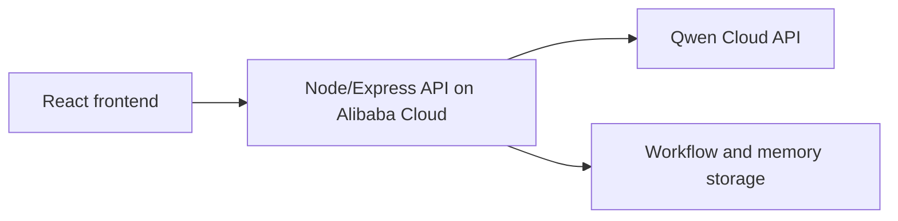

# Alibaba Cloud Deployment Proof Plan

This file is the submission-facing place to document how FunnelOps Autopilot runs on Alibaba Cloud.

## Current Status

Local vertical slice is working. Qwen Cloud calls have been verified locally. Alibaba Cloud deployment is the next submission-critical milestone.

## Target Backend Requirement

The hackathon requires proof that the backend is running on Alibaba Cloud. The proof package should include:

- A short screen recording of the deployed backend running on Alibaba Cloud.
- A public repository link to code that demonstrates Alibaba Cloud service/API usage.
- Environment variable setup without exposing secrets.
- A health endpoint that confirms the backend is alive.

## Planned Deployment Shape



## Backend Health Endpoint

```http
GET /api/health
```

Expected response:

```json
{
  "ok": true,
  "providerReady": true,
  "model": "qwen3.7-plus"
}
```

## Secrets

Required deployment secret:

```bash
QWEN_API_KEY=...
```

Do not commit this value.

## TODO Before Submission

- Choose exact Alibaba Cloud service.
- Add deployment commands.
- Add proof screenshot or recording link.
- Add deployed backend URL.
- Add repo link to the service configuration or deployment code.
