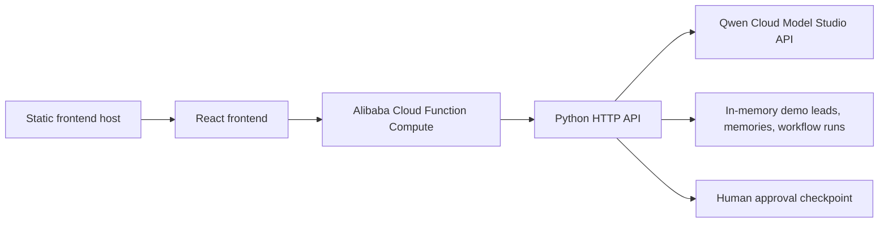

# Alibaba Cloud Deployment Proof

This file documents the deployment path used for the FunnelOps Autopilot hackathon submission.

## Live Deployment

- Alibaba Cloud service: Function Compute 3.0
- Region: China (Hangzhou)
- Function name: `funnelops-autopilot`
- Runtime: Custom Runtime (Debian 10), Python 3.10
- Startup command: `python3 app.py`
- Listening port: `8787`
- Public URL: `https://funneloutopilot-gbbnrquvwd.cn-hangzhou.fcapp.run`
- Health check: `https://funneloutopilot-gbbnrquvwd.cn-hangzhou.fcapp.run/api/health`

Important: Alibaba Cloud's default Function Compute domain forces `Content-Disposition: attachment` for browser visits, so the default domain is used as backend proof, not as the primary user-facing app URL. The user-facing app is deployed separately as a static frontend and calls this Alibaba backend through `VITE_API_BASE_URL`.

Verified live health response:

```json
{
  "ok": true,
  "providerReady": true,
  "model": "qwen3.7-plus"
}
```

## Qwen Cloud Usage Proof

The deployed backend calls Qwen Cloud through Alibaba Cloud Model Studio's OpenAI-compatible API.

Environment variables configured in Function Compute:

- `QWEN_API_KEY`
- `QWEN_BASE_URL=https://dashscope-intl.aliyuncs.com/compatible-mode/v1`
- `QWEN_MODEL=qwen3.7-plus`
- `PORT=8787`

Secrets are configured in Alibaba Cloud only and are not committed to the repository.

The deployed adapter tries the configured hackathon model first, then falls back to available Qwen models if the selected model is unavailable for the account. A live test from Function Compute successfully invoked Qwen:

```json
{
  "provider": "qwen",
  "endpoint": "https://dashscope-intl.aliyuncs.com/compatible-mode/v1",
  "model": "qwen-plus",
  "totalTokens": 1482
}
```

## Architecture



## Deployment Code

The Function Compute adapter lives at:

```text
deploy/app.py
```

It provides:

- `GET /api/health`
- `GET /api/bootstrap`
- `POST /api/agent/run`
- `POST /api/advisor/run`
- `POST /api/runs/:id/decision`
- Static frontend serving from `dist`

## Build Package

Build the frontend:

```bash
npm run build
```

Create the Function Compute zip locally:

```bash
mkdir -p deploy/fc-python-package
cp deploy/app.py deploy/fc-python-package/app.py
cp -R dist deploy/fc-python-package/dist
cd deploy/fc-python-package
zip -qr ../funnelops-fc-python.zip app.py dist
```

Upload `deploy/funnelops-fc-python.zip` to Function Compute using **Upload ZIP Package**, then deploy.

## Proof Recording Checklist

Record a short video showing:

1. Alibaba Cloud Function Compute page for `funnelops-autopilot`.
2. Runtime: Custom Runtime (Debian 10), Python 3.10.
3. Startup command: `python3 app.py`.
4. Public URL enabled.
5. Environment variable names present without exposing `QWEN_API_KEY`.
6. `GET /api/health` returning `providerReady: true`.
7. One `POST /api/agent/run` call showing provider `qwen` and token usage.

## Notes For Judges

FunnelOps Autopilot is submitted under Track 4: Autopilot Agent. It also demonstrates MemoryAgent-style behavior through memory scoring, selected memory retrieval, stale-memory fallback, and human approval before high-impact customer actions.
