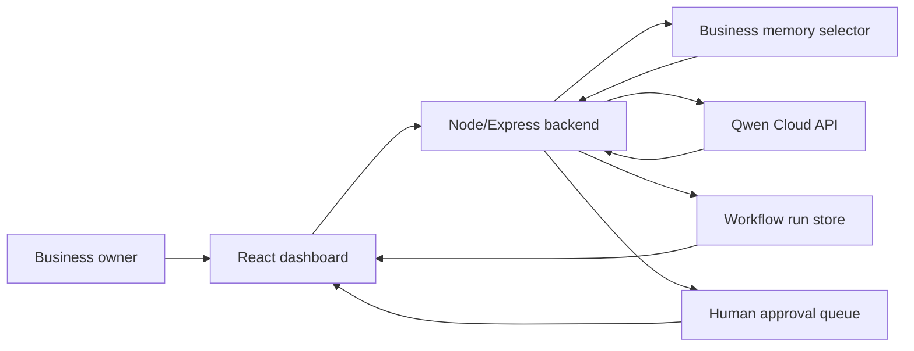

# FunnelOps Autopilot

Qwen Cloud-powered inbound sales autopilot for solo service sellers, creator-consultants, boutique agencies, and small operators who receive messy leads from DMs, comments, forms, email, and chat.

## Hackathon Track

Primary track: **Track 4 - Autopilot Agent**

Secondary depth: persistent memory, memory retrieval within context budget, human-in-the-loop approval, traceable workflow runs.

## What The Demo Proves

1. A messy inbound lead arrives.
2. The backend calls Qwen Cloud through the OpenAI-compatible endpoint.
3. The agent classifies intent, urgency, budget signal, objections, and missing info.
4. Relevant business memories are selected by importance, confidence, freshness, and text relevance.
5. The agent drafts a reply and follow-up plan.
6. Human approval is required before important sales actions.
7. The workflow run logs trace steps and token usage.

## Local Setup

```bash
npm install
cp .env.example .env
```

Add your Qwen Cloud API key to `.env`:

```bash
QWEN_API_KEY=your_key_here
```

Run the app:

```bash
npm run dev
```

Open the Vite URL, usually `http://localhost:5173`.

If `QWEN_API_KEY` is missing, the app uses a clearly labeled fallback agent result so the UI can still be tested without exposing credentials.

For a static frontend deployment, set:

```bash
VITE_API_BASE_URL=https://funneloutopilot-gbbnrquvwd.cn-hangzhou.fcapp.run
```

## Scripts

```bash
npm test
npm run build
npm run dev
```

## Architecture



Detailed architecture notes are in [`docs/ARCHITECTURE.md`](docs/ARCHITECTURE.md).

## Submission Assets

- User-facing app: GitHub Pages deployment from `.github/workflows/pages.yml`
- Alibaba Cloud backend proof: `https://funneloutopilot-gbbnrquvwd.cn-hangzhou.fcapp.run/api/health`
- Devpost draft: [`outputs/devpost-project-details-draft.md`](outputs/devpost-project-details-draft.md)
- Architecture: [`docs/ARCHITECTURE.md`](docs/ARCHITECTURE.md)
- Alibaba Cloud deployment proof: [`DEPLOYMENT.md`](DEPLOYMENT.md)
- Demo script: [`docs/DEMO_SCRIPT.md`](docs/DEMO_SCRIPT.md)
- Submission checklist: [`docs/SUBMISSION_CHECKLIST.md`](docs/SUBMISSION_CHECKLIST.md)

## Security

- Qwen API keys must stay server-side.
- Do not commit `.env`.
- Do not paste API keys into chat, Notion, screenshots, or demo videos.
- Frontend calls app-specific endpoints such as `/api/agent/run`, not Qwen Cloud directly.

## Alibaba Cloud Proof Plan

The backend is deployed on Alibaba Cloud Function Compute. The deployment adapter is [`deploy/app.py`](deploy/app.py), and the proof notes are in [`DEPLOYMENT.md`](DEPLOYMENT.md).

## License

MIT
