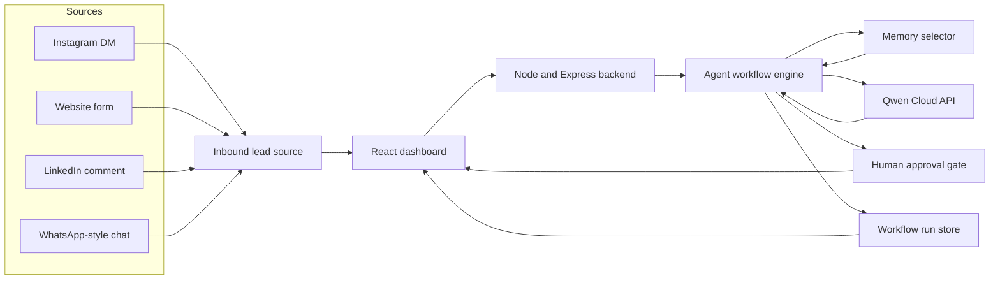

# FunnelOps Autopilot Architecture

FunnelOps Autopilot is a Qwen Cloud-powered inbound sales agent for solo sellers and small service teams. The system is designed to prove Track 4, Autopilot Agent, with MemoryAgent-style depth.

## System Diagram

## Runtime Flow

1. A messy inbound lead is selected in the dashboard.
2. The frontend calls the backend endpoint `/api/agent/run`.
3. The backend selects relevant memories using importance, confidence, freshness, and text relevance.
4. The backend calls Qwen Cloud through the OpenAI-compatible API.
5. Qwen returns structured lead analysis, draft reply, follow-up plan, and approval recommendation.
6. The backend stores the workflow run, trace steps, and token usage.
7. The frontend displays the approval queue, retrieved memories, agent trace, and Qwen usage ledger.

## Qwen Cloud Usage

Qwen Cloud powers:

- Lead classification.
- Memory-aware reasoning.
- Reply drafting.
- Next-best-action planning.
- Follow-up recommendations.
- AI Revenue Advisor reports.
- Structured JSON output for traceable workflows.

The key code path is [`src/lib/qwen.ts`](../src/lib/qwen.ts), called by [`server/index.ts`](../server/index.ts).

## Human Control

Important actions are not sent automatically. Pricing, quotes, discounts, uncertain responses, and high-impact messages go through a human approval gate.

## Persistence

Workflow runs are stored in a local file-backed runtime store for the hackathon slice. The storage boundary is isolated so it can be replaced by Alibaba Cloud database storage during deployment hardening.

